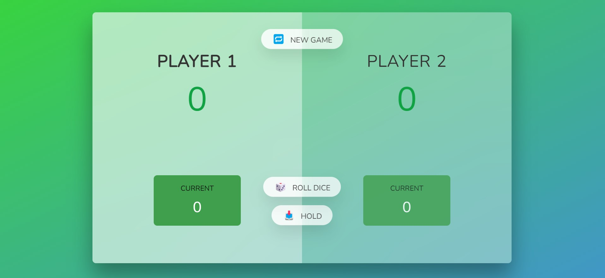

<h1 align="center">
Roll 80
</h1>

<h2 align="center">
  HTML + CSS+ JS 🎲 Roll the Dice 🎲 
</h2>

 Roll80 is the vanillaJs game , where the player who scores 80 first , will became the winner .   

 
  <kbd>
</img>
  </kbd>

 
  <kbd>
</img>
  </kbd>

#### check out the deployed project :https://roll80.netlify.app/
## :fire: Features

:white_check_mark: dice rolling \
:white_check_mark: player slide adjustment \
:white_check_mark: Cool UI \
:white_check_mark: Easy to navigate between player \
:white_check_mark: Hold Button, for holding current scores  \
:white_check_mark: Reset the game \

## 🛠️ Technologies used 
The technology used are
-- 
- [HTML](https://www.w3schools.com/html/)
- [CSS](https://www.w3schools.com/css/) 
- [JS](https://v2.tailwindcss.com/docs)
- [GitHub](https://github.com)
- [netlify](https://netlify.com)

## 🤝 Contributing

Any idea on how we can make this more awesome ? [Open a new issue](https://github.com/hritikd3/issues)! 

